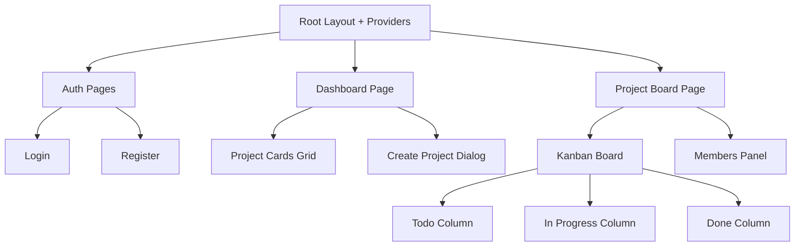

# DevFlow Frontend — Walkthrough

## What Was Built

A complete **Next.js 16** frontend for the DevFlow project management backend, located in `client/`.

### Architecture



### Files Created (22 files)

| Category | Files |
|----------|-------|
| **Types** | [types/index.ts](file:///c:/Users/risha/Desktop/Codes/Dev/Devflow/client/types/index.ts) |
| **API Layer** | [lib/axios.ts](file:///c:/Users/risha/Desktop/Codes/Dev/Devflow/client/lib/axios.ts), [lib/api/auth.ts](file:///c:/Users/risha/Desktop/Codes/Dev/Devflow/client/lib/api/auth.ts), [lib/api/projects.ts](file:///c:/Users/risha/Desktop/Codes/Dev/Devflow/client/lib/api/projects.ts), [lib/api/tasks.ts](file:///c:/Users/risha/Desktop/Codes/Dev/Devflow/client/lib/api/tasks.ts) |
| **State** | [store/auth.ts](file:///c:/Users/risha/Desktop/Codes/Dev/Devflow/client/store/auth.ts) |
| **Providers** | [components/providers.tsx](file:///c:/Users/risha/Desktop/Codes/Dev/Devflow/client/components/providers.tsx), [components/theme-provider.tsx](file:///c:/Users/risha/Desktop/Codes/Dev/Devflow/client/components/theme-provider.tsx) |
| **Layout** | [components/sidebar.tsx](file:///c:/Users/risha/Desktop/Codes/Dev/Devflow/client/components/sidebar.tsx), [components/navbar.tsx](file:///c:/Users/risha/Desktop/Codes/Dev/Devflow/client/components/navbar.tsx), [components/app-layout.tsx](file:///c:/Users/risha/Desktop/Codes/Dev/Devflow/client/components/app-layout.tsx), [components/auth-guard.tsx](file:///c:/Users/risha/Desktop/Codes/Dev/Devflow/client/components/auth-guard.tsx) |
| **Components** | [components/project-card.tsx](file:///c:/Users/risha/Desktop/Codes/Dev/Devflow/client/components/project-card.tsx), [components/create-project-dialog.tsx](file:///c:/Users/risha/Desktop/Codes/Dev/Devflow/client/components/create-project-dialog.tsx), [components/create-task-dialog.tsx](file:///c:/Users/risha/Desktop/Codes/Dev/Devflow/client/components/create-task-dialog.tsx), [components/members-panel.tsx](file:///c:/Users/risha/Desktop/Codes/Dev/Devflow/client/components/members-panel.tsx) |
| **Kanban** | [components/kanban/board.tsx](file:///c:/Users/risha/Desktop/Codes/Dev/Devflow/client/components/kanban/board.tsx), [components/kanban/column.tsx](file:///c:/Users/risha/Desktop/Codes/Dev/Devflow/client/components/kanban/column.tsx), [components/kanban/task-card.tsx](file:///c:/Users/risha/Desktop/Codes/Dev/Devflow/client/components/kanban/task-card.tsx) |
| **Pages** | [app/layout.tsx](file:///c:/Users/risha/Desktop/Codes/Dev/Devflow/client/app/layout.tsx), [app/page.tsx](file:///c:/Users/risha/Desktop/Codes/Dev/Devflow/client/app/page.tsx), [app/(auth)/layout.tsx](file:///c:/Users/risha/Desktop/Codes/Dev/Devflow/client/app/(auth)/layout.tsx), [app/(auth)/login/page.tsx](file:///c:/Users/risha/Desktop/Codes/Dev/Devflow/client/app/(auth)/login/page.tsx), [app/(auth)/register/page.tsx](file:///c:/Users/risha/Desktop/Codes/Dev/Devflow/client/app/(auth)/register/page.tsx), [app/dashboard/page.tsx](file:///c:/Users/risha/Desktop/Codes/Dev/Devflow/client/app/dashboard/page.tsx), [app/project/[id]/page.tsx](file:///c:/Users/risha/Desktop/Codes/Dev/Devflow/client/app/project/[id]/page.tsx) |

## Key Design Decisions

- **Dark mode by default** via `next-themes` with `defaultTheme="dark"`
- **Optimistic drag-and-drop** — Kanban updates UI immediately before API confirms
- **Violet/Indigo gradient** accent throughout — buttons, logo, badges
- **Icon-only sidebar** (68px wide) — keeps the layout spacious
- **Zustand for auth only** — all API data flows through React Query
- **Axios interceptors** handle all error toasts globally — no per-component error handling needed

## How to Run

```bash
cd client
npm install      # already done
npm run dev      # starts on http://localhost:3000
```

## Backend Prerequisites

> [!WARNING]
> Before running the frontend against the backend, you need to fix these in the server:

1. **Add CORS middleware** to `server/app/main.py`:
   ```python
   from fastapi.middleware.cors import CORSMiddleware
   app.add_middleware(CORSMiddleware, allow_origins=["http://localhost:3000"], allow_credentials=True, allow_methods=["*"], allow_headers=["*"])
   ```

2. **Include task routes** in `server/app/main.py`:
   ```python
   from app.api.routes.task_routes import router as task_router
   app.include_router(task_router)
   ```

## Verification

- ✅ `npm run build` completed with **exit code 0**
- ✅ All 7 static pages generated successfully
- ✅ No TypeScript errors
